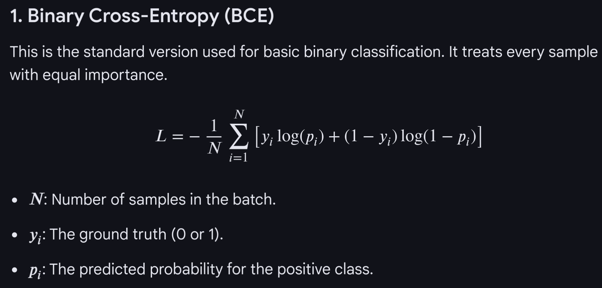
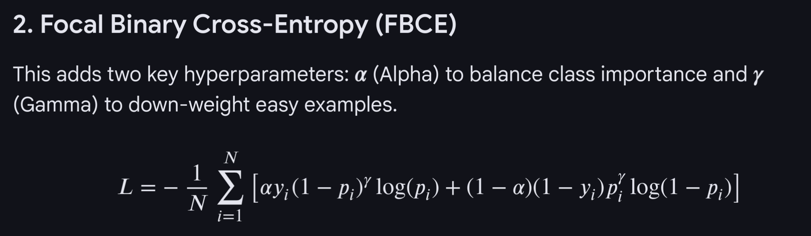

# Loss function notes

fraud (y = 1), normal (y = 0)

97% normal and 3% fraud. Ratio = 97/3 = 32×

## α: class weighting

**α** just introduces more weight for the rare fraud class. Just weighted whatever loss, weighted BCE. To get the perfect balance we can leave the normal loss alone without α, and we could multiply fraud loss by 32. This would make the loss for two classes equal and there would be no imbalance from loss or gradient perspective for the model.

Or, as in the formula, we can make:

- α = 0.97 for fraud
- normal weight = 0.3

so you get the same 32× difference.

### Is it good?

It solves the imbalance problem from a loss perspective. The model learns both normal and fraud data at the same rate. But the data is still imbalanced. So very little data (3%) is carrying the same weight as a lot of data (97%). This is not bad in itself, but if we have very little data for a given class, the signal can be very noisy.

Especially for something like fraud with varying trends and schemes. Fraud is inherently noisy. So the model overfits to that noise.

So we can’t have α = ratio. We need α < ratio.

For example:

- α = 0.8 (4×) instead of 0.97 (32×)

We still say: care about these rare cases much more than numerous normal cases, but do not be fanatic about it.

## γ: focal-like scaling

However, we are back to our loss / gradient imbalance problem, even though not so severe this time. So **γ** comes to help.

To see how it works, forget α exists. We have raw cross-entropy loss and this gamma thing. Set γ = 2.

Now we scale:

- fraud loss by $(1 - p)^2$
- normal loss by $p^2$

### Prediction examples

- Bad fraud prediction: $p = 0.1$ → scaled loss $(1 - 0.1)^2 = 0.81$  (removed 19% of the loss)
- Good fraud prediction: $p = 0.9$ → scaled loss $(1 - 0.9)^2 = 0.01$  (removed 99% of the loss)
- Bad normal prediction: $p = 0.9$ → scaled loss $0.9^2 = 0.81$  (removed 19% of the loss)
- Good normal prediction: $p = 0.1$ → scaled loss $0.1^2 = 0.01$  (removed 99% of the loss)

So regardless of the class, if we have a big loss (bad prediction), we trim it only a little, but if we have a small loss (good prediction), we nuke it towards 0.

## No α, only γ

What happens in this scenario (no α, no weighted loss, just γ = 2)?

Because there is no α, the loss is imbalanced, so the model tries to roll in the opposite direction of the total loss, which is dominated by the normal class.

- **Stage A:** the model learns how to correctly identify normal.
- **Stage B:** at some point the model becomes quite alright with normal data.

Say on average for normal data it gives $p = 0.2$ (20% chance fraud).

- Normal loss: $L = 0.2^2 \times -\log(1 - 0.2) = 0.04 \times -\log(0.8) \approx 0.09$
- Fraud loss (poor prediction): $L = (1 - 0.2)^2 \times -\log(0.2) = 0.64 \times -\log(0.2) \approx 1.03$

The loss for bad fraud is about 10× more than good normal. Naturally, if the model gets even better with normal, the loss for normal decreases as $x^2$, so the gradient gets exponentially smaller. You can look at the $y = x^2$ graph: as loss approaches 0, the gradient becomes flat, and the model is no longer interested in moving in the opposite direction.

On the other hand, we still have large loss for fraud data, and γ largely preserves big losses, so the gradient there remains. As a result, after learning normals decently enough, the model switches to learning fraud.

> Recap: stage A learn normal, stage B learn fraud.

---

## α vs γ tradeoff

We also don’t risk overfitting with γ like with α because we are not making every fraud datapoint look very big.

So why use α if γ is super smart, solves the problem, and does not overfit? It’s kind of a smart implicit regularization parameter while α is a clumsy weight parameter that both aim to solve the same thing.

Well:

1. With this two-stage approach, we lose almost all signal from fraud data in stage A. Fraud data is already rare, and we do not want to completely sacrifice that portion.
2. If you do sacrifice, to make up for it, to give the model enough room to converge in stage B, you have to give more data, which means more iterations and more compute.

So you are sacrificing two precious resources: data and compute time.

If you are okay with it, yes, it may converge to the optimal weights. If you don’t like that, you still use α, just moderately (4× instead of clumsy 32×), so that it is not utterly forgotten in stage A.

1. The model actually may never converge if you are using modern optimizers like Adam or SGD with momentum. If in the last 50 iterations you largely moved in the opposite direction of the gradient of normal loss, you’ve built up so much momentum that it may just overwhelm the exponential shrinkage of γ.

---
---
---

## Training alpha and gamma: Bayesian (Optuna) vs GradDescent (Adam)

Since you initialized alpha and gamma as standard floats in your current code, Optuna is the only way to tune them. If you changed them to nn.Parameter, Adam could technically touch them, but it’s almost always a bad idea.
Here is why Optuna (probabilistic scanning) is better for these specific values:
## 1. The "Cheating" Problem
If you let Adam tune alpha and gamma via gradients, the model will "cheat" to make the loss number smaller without actually getting smarter.

* If the model is struggling, it might realize that decreasing gamma or alpha makes the total loss number drop instantly.
* The Optimizer thinks it's doing a great job because the loss is lower, but in reality, it just made the "test" easier rather than learning the data better.

## 2. The Non-Convex Landscape
Adam (Moving Downhill) works best on "smooth" hills (weights). Hyperparameters like gamma often create "jagged" or "flat" landscapes where gradients don't tell you much. Optuna doesn't care about the slope; it just looks at the final validation score and says, "This setting worked better for the overall accuracy."
## 3. Validation vs. Training

* Adam tunes parameters based on Training Loss.
* Optuna tunes hyperparameters based on Validation Metrics (like F1-score or PR-AUC).
* Since you are dealing with fraud imbalance, you care about the F1-score on "unseen" data. Optuna is built exactly for that.

## Summary Recommendation
Keep your FocalLoss exactly as it is (using floats). Use Optuna to suggest the values:

# Inside your Optuna objective function:gamma = trial.suggest_float("gamma", 0.5, 5.0)alpha = trial.suggest_float("alpha", 0.1, 0.9)criterion = FocalLoss(alpha=alpha, gamma=gamma)

This ensures your model is learning the fraud patterns with Adam, while Optuna is finding the perfect lens (the loss function) for the model to see those patterns through.
Would you like to see how to define the Optuna trial to search for these two specific values?

